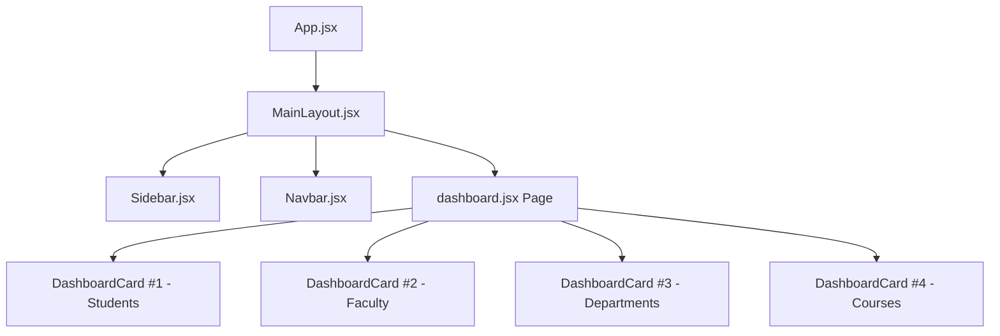

# 🧩 Component Guide

This guide details all React components in the project, their props, state, lifecycle, and common beginner pitfalls.

---

## 🌳 Component Hierarchy Tree



---

## 📘 Component Breakdown

### 1. `App`
- **File**: `client/src/App.jsx`
- **Purpose**: Root component assembling the main layout and active page view.
- **Props**: None.
- **State**: None.
- **Code Snippet**:
  ```jsx
  import MainLayout from "./layouts/MainLayout";
  import Dashboard from "./pages/Dashboard/Dashboard";

  function App() {
    return (
      <MainLayout>
        <Dashboard />
      </MainLayout>
    );
  }
  ```

---

### 2. `MainLayout`
- **File**: `client/src/layouts/MainLayout.jsx`
- **Purpose**: Structural layout wrapper providing a consistent Sidebar, Navbar, and content container.
- **Props Table**:
  | Prop Name | Type | Required | Description |
  | :--- | :--- | :--- | :--- |
  | `children` | React Node | Yes | Page component rendered inside `<main>` content container |

- **Code Snippet**:
  ```jsx
  function MainLayout({ children }) {
    return (
      <div className="flex">
        <Sidebar />
        <div className="flex-1">
          <Navbar />
          <main className="p-6 bg-gray-100 min-h-screen">
            {children}
          </main>
        </div>
      </div>
    );
  }
  ```
- **Common Beginner Mistakes**:
  - Writing `function MainLayout(children)` without destructured `{ children }` curly braces.

---

### 3. `Navbar`
- **File**: `client/src/components/layout/Navbar.jsx`
- **Purpose**: Top navigation bar header placeholder.
- **Props**: None.
- **State**: None.

---

### 4. `Sidebar`
- **File**: `client/src/components/layout/Sidebar.jsx`
- **Purpose**: Left-side menu bar placeholder.
- **Props**: None.
- **State**: None.

---

### 5. `Dashboard`
- **File**: `client/src/pages/dashboard/dashboard.jsx`
- **Purpose**: Main administrative page view displaying summary metrics.
- **Props**: None.
- **State**: None (currently static mock values).
- **Code Snippet**:
  ```jsx
  <div className="grid grid-cols-1 md:grid-cols-2 lg:grid-cols-4 gap-6">
    <DashboardCard title="Students" value="1250" />
    <DashboardCard title="Faculty" value="82" />
    <DashboardCard title="Departments" value="6" />
    <DashboardCard title="Courses" value="35" />
  </div>
  ```
- **Common Beginner Mistakes**:
  - Importing `DashboardCard` with mismatched filename casing (`DashboardCard` vs `dashboardCard.jsx`).

---

### 6. `DashboardCard`
- **File**: `client/src/components/dashboard/dashboardCard.jsx`
- **Purpose**: Reusable stat card presenting a metric title and count value.
- **Props Table**:
  | Prop Name | Type | Required | Description |
  | :--- | :--- | :--- | :--- |
  | `title` | String | Yes | Category label (e.g. `"Students"`) |
  | `value` | String / Number | Yes | Numeric count display (e.g. `"1250"`) |

- **Code Snippet**:
  ```jsx
  function DashboardCard({ title, value }) {
    return (
      <div className="bg-white rounded-xl shadow-md p-6">
        <h3 className="text-gray-500 text-sm">{title}</h3>
        <h1 className="text-3xl font-bold mt-2">{value}</h1>
      </div>
    );
  }
  ```

---

## ✏️ Component Practice Exercises

1. **Add a Subtitle to `DashboardCard`**:
   Modify `DashboardCard` to accept an optional `subtitle` prop (e.g. `subtitle="+12% this month"`) and display it in small green text.

2. **Add a Loading Spinner State**:
   Practice adding a boolean prop `isLoading` to `DashboardCard` that displays `"Loading..."` when true.

---

[← Back to Folder Structure](folder-structure.md) | [Next: Debugging Guide →](debugging.md)
