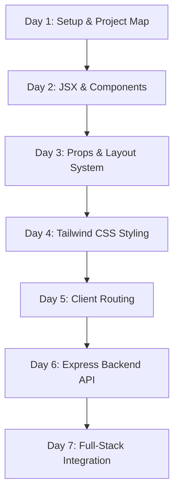

# 🗺️ Learning Path & Progression Guide

This guide outlines what a beginner student should focus on each day while exploring this project.

---

## 📈 Visual Learning Progression Flow



---

## 📅 "What Should I Learn Today?" Daily Tracker

### 🟢 Day 1: Project Environment & Navigation
- [ ] Understand the difference between `/client` and `/server`.
- [ ] Run `npm run dev` inside `/client` and open `http://localhost:5173`.
- [ ] Inspect `index.html`, `main.jsx`, and `App.jsx`.

> [!TIP]
> **Key Concept: Single Page Application (SPA)**
> In React, `index.html` only has one `<div id="root"></div>`. React dynamically injects all visual components inside this single div!

---

### 🟢 Day 2: React Components & JSX
- [ ] Understand how JSX combines HTML-like markup with JavaScript.
- [ ] Read `client/src/components/dashboard/dashboardCard.jsx`.
- [ ] Learn why React component names MUST start with a capital letter.

```jsx
// Example JSX Component
function WelcomeBanner() {
  const adminName = "Admin";
  return <h1>Welcome Back, {adminName} 👋</h1>;
}
```

---

### 🟢 Day 3: Props & Layout Composition
- [ ] Learn how props pass data down from parent to child components.
- [ ] Study how `dashboard.jsx` passes `title` and `value` into `<DashboardCard />`.
- [ ] Understand the `{children}` prop inside `MainLayout.jsx`.

```jsx
// Passing props to child
<DashboardCard title="Students" value="1250" />
```

---

### 🟢 Day 4: Tailwind CSS v4 & Responsive Layouts
- [ ] Learn utility-first styling vs traditional CSS.
- [ ] Understand Flexbox (`flex`, `flex-1`) in `MainLayout.jsx`.
- [ ] Understand CSS Grid (`grid-cols-1 md:grid-cols-2 lg:grid-cols-4`) in `dashboard.jsx`.

| Utility | Meaning | Example |
| :--- | :--- | :--- |
| `p-6` | Padding 1.5rem (24px) | `<div className="p-6">` |
| `rounded-xl` | Rounded corners | `<div className="rounded-xl">` |
| `shadow-md` | Box shadow | `<div className="shadow-md">` |

---

### 🟡 Day 5: Client-Side Routing Concepts
- [ ] Learn why traditional page reloads are replaced by client-side routing.
- [ ] Explore `react-router-dom` concepts (`BrowserRouter`, `Routes`, `Route`, `Link`).

---

### 🟡 Day 6: Node.js & Express API Server
- [ ] Explore `server/package.json` backend dependencies.
- [ ] Understand REST HTTP verbs (`GET`, `POST`, `PUT`, `DELETE`).
- [ ] Learn what Express middleware (`app.use()`) does.

---

### 🔴 Day 7: Full-Stack Data Fetching (Axios + Hooks)
- [ ] Learn how React's `useEffect` hook triggers API calls when a page loads.
- [ ] Learn how `axios.get('http://localhost:5000/api/stats')` fetches backend data.
- [ ] Replace static card numbers with dynamic server responses!

---

[← Back to Debugging](debugging.md) | [Next: Beginner Exercises →](exercises.md)
