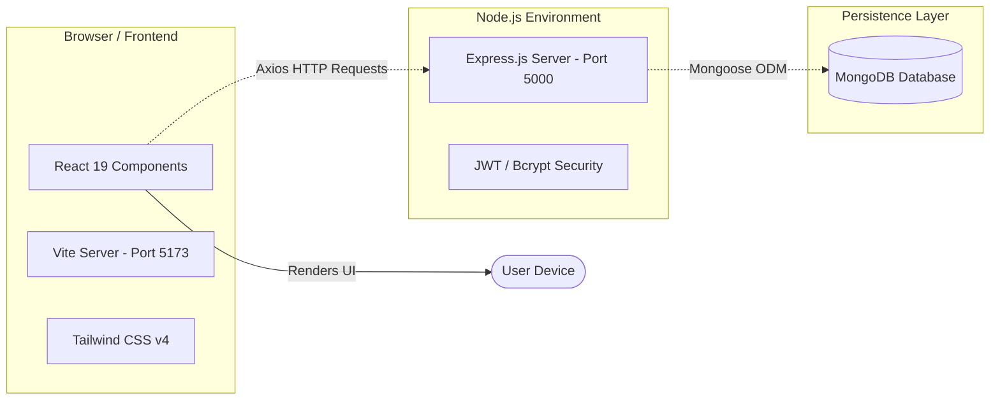
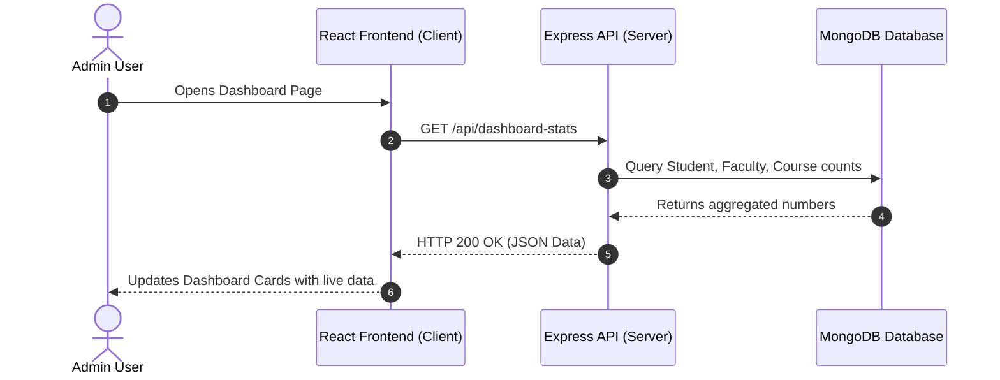

# 🏗️ Project Architecture

This document explains the high-level design, data flow, and technology stack of the **College ERP Dashboard**.

---

## 📐 System Design Overview

The application follows a standard **Client-Server Architecture** using the **MERN** stack paradigm:

---

## 🔄 Client-Server Communication Flow

Here is how data flows from user action to backend database and back:

---

## 🧱 Layer Breakdown

| Layer | Responsibility | Key Technologies |
| :--- | :--- | :--- |
| **Presentation (Client)** | Displays UI, handles user input, routes views | React 19, Tailwind v4, Vite |
| **Application (Server)** | Business logic, authentication, REST endpoints | Node.js, Express.js 5 |
| **Data (Database)** | Persistent data storage and schema validation | MongoDB, Mongoose 9 |

---

## 💡 Key Architectural Choices Explained

> [!NOTE]
> **Why Vite over Create React App?**
> Vite provides near-instantaneous dev server startup and lightning-fast Hot Module Replacement (HMR).

> [!NOTE]
> **Why Tailwind CSS v4 over Vanilla CSS?**
> Tailwind allows developers to build modern, responsive layouts directly inside JSX using pre-defined utility classes (`flex`, `grid`, `rounded-xl`), eliminating context-switching between CSS and JS files.

> [!NOTE]
> **Why Separate Client & Server Folders?**
> Keeps frontend code completely decoupled from backend logic, allowing independent deployment, testing, and team scaling.

---

[← Back to Getting Started](getting-started.md) | [Next: Folder Structure & File Guide →](folder-structure.md)
