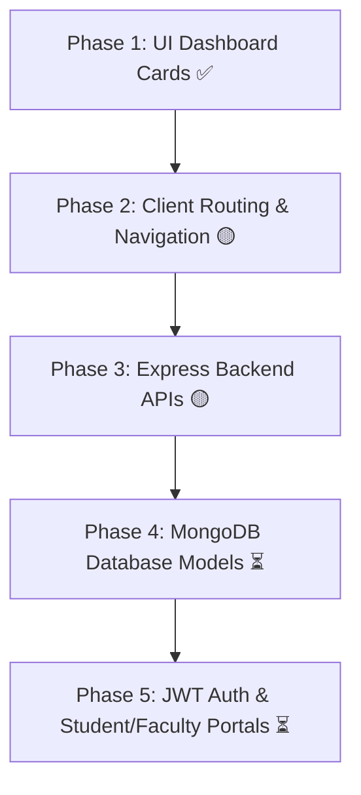

# 🎯 Development Roadmap

This roadmap outlines the logical phases for building and extending the **College ERP Dashboard**.

---

## 📊 Current Project Status

| Phase | Description | Status | Core Technologies |
| :--- | :--- | :--- | :--- |
| **Phase 1** | Frontend UI Skeleton & Card Grid | ✅ Completed | React 19, Tailwind CSS v4, Vite |
| **Phase 2** | Navigation Layout & Routing | 🟡 In Progress | React Router DOM |
| **Phase 3** | Backend Express API & Server Setup | 🟡 In Progress | Node.js, Express.js |
| **Phase 4** | Database Integration | ⏳ Planned | MongoDB, Mongoose |
| **Phase 5** | Authentication & User Roles | ⏳ Planned | JWT, Bcrypt |

---

## 🗺️ Phase-by-Phase Execution Plan

---

## 📋 Detailed Phase Breakdown

### Phase 1: Basic Dashboard UI Structure (Completed ✅)
- [x] Set up React 19 frontend with Vite.
- [x] Configure Tailwind CSS v4 utility classes.
- [x] Build `<MainLayout />` with Sidebar and Navbar placeholders.
- [x] Create responsive `<DashboardCard />` grid.

---

### Phase 2: Client-Side Routing & Sub-Pages (In Progress 🟡)
- [ ] Connect `react-router-dom` inside `App.jsx`.
- [ ] Create `/students` page with a student data table component.
- [ ] Create `/faculty` page with faculty cards.
- [ ] Create `/courses` page listing departmental courses.
- [ ] Update `Sidebar.jsx` with active link styling using `<NavLink>`.

---

### Phase 3: Express REST API Backend (In Progress 🟡)
- [ ] Complete `server/app.js` with CORS and JSON parser middleware.
- [ ] Complete `server/server.js` listener on port `5000`.
- [ ] Add REST endpoints:
  - `GET /api/stats`: Returns current counts.
  - `GET /api/students`: Returns list of students.
  - `GET /api/faculty`: Returns list of faculty members.

---

### Phase 4: MongoDB Database Connection (Planned ⏳)
- [ ] Configure `server/config/database.js` with Mongoose.
- [ ] Create Mongoose models:
  - `models/Student.js`
  - `models/Faculty.js`
  - `models/Course.js`
- [ ] Replace static mock objects with live database queries.
- [ ] Connect React to Express using Axios (`useEffect` + `axios.get()`).

---

### Phase 5: Authentication & Role-Based Access Control (Planned ⏳)
- [ ] Build Login & Registration pages (`/login`).
- [ ] Implement password hashing with `bcryptjs`.
- [ ] Issue JSON Web Tokens (JWT) on login.
- [ ] Create role middleware (`admin`, `faculty`, `student`).

---

[← Back to Exercises](exercises.md) | [Back to Main README →](../README.md)
